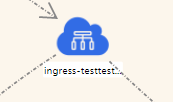
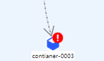
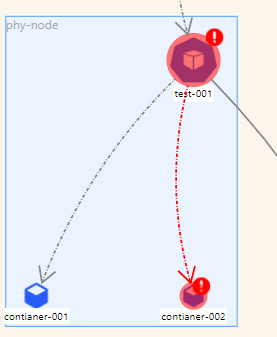

# Network topology

> 基于`@antv/g6`实现的拓扑图，适用于网络拓扑。

## Application scenario

在原生的 K8s 应用场景下，

- 自上而下展示应用部署的架构拓扑
- 每个拓扑节点展示关联的重要指标和事件等

## Feature

1. 节点正常

    

2. 节点异常，但不严重

    

3. 节点异常，并严重

    

4. 节点组

    

5. 总览

    

## Use

将拓扑图基本配置和方法封装成类`NTopo`,使用时调用构造函数，传入当前绑定的`dom`元素和可选参数`config`即可。

```bash
    const network = new NTopo('#mountNode', config)
```

`config`是一个对象，和`G6`的`graph`配置项`api`保持一致,额外自定义了默认配置，允许不传时直接采用默认配置项。类`NTopo`的方法也和`G6`的方法保持一致。
